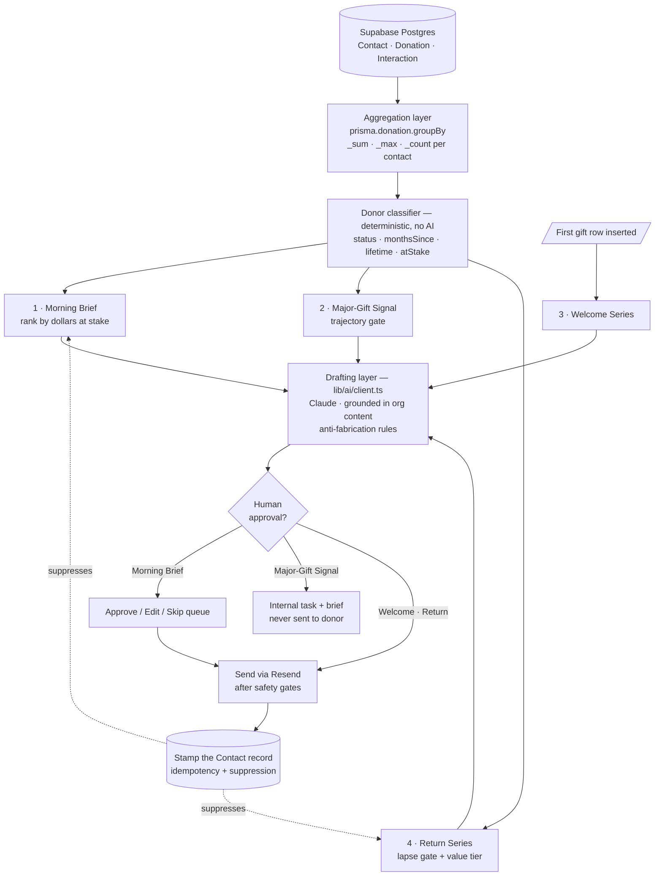

# SAGA Agents

> **The four donor-facing AI agents** — what each one does, when it fires, what it is allowed to do on its own, and how they're architected. This is the deep-dive companion to [ARCHITECTURE.md](ARCHITECTURE.md) (which covers the whole system) and [../CLAUDE.md](../CLAUDE.md) (orientation).
>
> **Status: none of the four are built.** What ships today is a deterministic classifier that produces the dashboard's donor intelligence. This document separates "built" from "designed" in every section — do not present anything marked 🚧 as working software.

---

## 0. Read this first — two different things in this repo are called "agents"

| Path | What it actually is | Related to this doc? |
|---|---|---|
| `lib/agents/` | A **developer-tooling** framework — `frontend-developer` and `backend-architect` code-generation agents with a CLI and an admin-only API. Its README describes an aspirational "31 agents". | ❌ **No.** Unrelated. |
| `lib/donors/` | Donor scoring, the agent catalog, and the live agent previews. | ✅ **Start here.** |
| `lib/ai/` | Anthropic SDK wrapper + narrative helpers. | ✅ Yes — the drafting layer. |

If you grep this repo for "agent" you will land in `lib/agents/` first and reach the wrong conclusion. The donor agents live under **`lib/donors/`**, and their send/schedule layer is not built yet.

---

## 1. The four agents at a glance

| # | Agent | Fires on | Talks to donors? | Autonomy | Rollout |
|---|---|---|---|---|---|
| 1 | **Morning Brief** | Schedule (daily, pre-dawn) | Only after a human approves each send | Drafts + ranks; human approves | Phase 2 |
| 2 | **Major-Gift Signal** | Schedule (nightly) | **Never** | Fully autonomous — blast radius is internal | Phase 1 |
| 3 | **Welcome Series** | Event (first gift lands) | Yes | Fully autonomous, donor-facing | Phase 3 |
| 4 | **Return Series** | Schedule (weekly) | Yes, below a value threshold only | Autonomous + value-tiered escalation | Phase 4 |

**Why the rollout order isn't 1-2-3-4:** autonomy is earned. Major-Gift Signal ships first because it *cannot* reach a donor — the worst case is a fundraiser reads a bad brief. Return Series ships last because it makes the hardest judgement call (who to email vs. who to hand to a person) and it acts on the most fragile relationships.

---

## 2. Shared architecture

All four agents sit on one data layer and one classifier. That's what makes them a capability rather than four disconnected features.



### The four layers

**1. Data layer.** Everything derives from `Contact` and `Donation`, scoped by `organizationId`. No agent gets its own store. Tenant isolation is app-code enforced and fail-closed — see [ARCHITECTURE.md §5](ARCHITECTURE.md#5-authentication--multi-tenancy).

**2. Aggregation.** `prisma.donation.groupBy({ by: ['contactId'], _sum, _max, _count })`. Deliberately *not* an unbounded `include` of every donation — that pattern was removed during the `/demo` build because it hydrates the whole gift table to compute four numbers.

**3. Classifier (deterministic).** Pure function, no AI, no network. Same input always produces the same output, so it is testable and cheap. This is what runs today.

**4. Drafting (AI).** Only this layer calls Claude. Every agent's language output goes through it with a shared anti-fabrication contract (§6). The classifier decides *who* and *why*; the model only decides *how to say it*.

Keeping 3 and 4 separate is the single most important design decision here. Ranking donors by dollars at stake is arithmetic — asking a language model to do it would be slower, more expensive, non-deterministic, and impossible to unit-test.

---

## 3. What exists today (✅ built)

**`lib/donors/scoring.ts`** — the classifier, and the single source of donor math. `scoreDonor()` is consumed by the dashboard, `/demo`, the donor detail page, the donation detail page, the four agent pages, and the seed reporter, so no two surfaces can disagree about the same donor.

**`lib/donors/agent-catalog.ts`** and **`lib/donors/agent-preview.ts`** — the agent descriptions, and the selection logic run live against real org data. Every agent has a page in the app (`/morning-brief`, `/major-gift-signal`, `/welcome-series`, `/return-series`) showing exactly who it would act on today.

The status buckets:

```ts
if (count === 1 && monthsSince < 2)            status = 'New donor'  atStake = avg * 4
else if (lifetime >= 10000 && monthsSince < 6) status = 'Champion'   atStake = avg * 2
else if (monthsSince >= 12)                    status = 'Lapse risk' atStake = avg * 1.5
else if (monthsSince >= 6)                     status = 'Cooling'    atStake = avg
else                                           status = 'Active'     atStake = avg
```

Donors needing attention are everything except `Active`, **sorted by dollars at stake descending**. Status is deliberately *not* the primary sort — it is already weighted into `atStake` through the multipliers below, so sorting by it first double-counts status and lets a $425 lapse risk outrank a $10,000 donor who just went quiet.

The `atStake` multipliers encode a claim about *replacement cost*: a brand-new donor is worth 4× their gift because the second gift is where retention is won or lost; a lapsing donor is worth 1.5× because winning them back is cheaper than acquiring someone new. **These multipliers are a starting hypothesis, not a validated model.** They should be tuned against real retention data once SAGA has any.

**`lib/ai/`** — the drafting building blocks:

| File | Provides |
|---|---|
| `client.ts` | `generateText()` / `generateJSON()`; returns a null client and disables AI when `ANTHROPIC_API_KEY` is absent |
| `donor-profiles.ts` | `identifyMajorGiftProspects()`, `predictDonorLapseRisk()`, `calculateDonorEngagementScore()`, `generateDonorEmail()` |
| `donation-insights.ts` | Campaign performance, giving trends, executive summary |
| `receipt-generator.ts` | Thank-you and major-gift acknowledgement copy |
| `prompts.ts` | Shared system prompts and templates |

⚠️ **`lib/ai/client.ts` pins `claude-3-5-sonnet-20241022`.** That model is well behind current. Update it to a current Claude model before building any agent on top of it.

✅ **Resolved (2026-08-04):** `donor-profiles.ts` previously carried a second, disagreeing scoring system — `calculateDonorEngagementScore`, `identifyMajorGiftProspects` and `predictDonorLapseRisk`. The same donor could read "Lapse risk — personal call" on the dashboard and "Low — send a survey" on the donation page. Those three are deleted; their two good ideas (cadence-relative lapse detection and `reasons[]` explainability) were ported into `scoring.ts`, which now guarantees the levels cannot contradict the status. `analyzeDonorPattern` and `generateDonorEmail` remain — they write narrative rather than score, so they never conflicted.

---

## 4. Agent specifications

Each spec below is 🚧 **design, not code.**

### 4.1 Morning Brief

**One line:** the day's highest-impact donor actions, ranked, with the outreach already drafted.

| | |
|---|---|
| **Trigger** | Scheduled, daily before business hours |
| **Reads** | Classifier output for the whole org |
| **Writes** | A ranked queue of 3 actions + a drafted message per action |
| **Autonomy** | Ranks and drafts autonomously. **Sends nothing without a human.** |

**Logic.** Take all non-`Active` donors, sort by status priority then dollars at stake, take the top 3, draft outreach for each. Three, not thirty — a list of everything who needs attention is a report, and reports get ignored. The constraint is the product.

**Output.** Three cards, each with donor, status, dollars at stake, why now, and a drafted message. Actions: **Approve / Edit / Skip**.

**Guardrails**
- Nothing sends without explicit approval.
- Suppress any donor currently in an active Welcome Series or Return Series sequence (§5).
- Never state a reason a donor's giving changed — report the observation (`14 months quiet`), not a motive.

**Why it's its own agent:** it's the only one whose job is *prioritisation across the whole file*. The others each own one moment.

---

### 4.2 Major-Gift Signal

**One line:** finds donors whose giving is quietly accelerating and briefs the assigned fundraiser before the ask.

| | |
|---|---|
| **Trigger** | Scheduled, nightly |
| **Reads** | Full gift history per donor |
| **Writes** | An internal task + brief assigned to the donor's fundraiser |
| **Autonomy** | **Fully autonomous.** Never contacts a donor — the blast radius is entirely internal. |

**Gate — all three must pass:**

| Gate | Rule | Why |
|---|---|---|
| Depth | ≥ 3 gifts on file | Two gifts is not a trajectory |
| Recency | Last gift ≤ 6 months ago | A rising donor who then vanished is a *retention* problem, not a major-gift one |
| Trajectory | Last gift ≥ 1.5× the average of all prior gifts | The actual signal |

**The recency gate is why Return Series exists.** Major-Gift Signal deliberately ignores lapsed donors. Without a fourth agent, a $5,000 donor who went quiet falls through every net.

**Output.** A short brief: lifetime giving, last gift, the multiple, and a suggested next step. Facts and one interpretation — no invented biography.

**Guardrails**
- Never contacts a donor.
- Never speculates about wealth, employment, health, family, or motive.
- Reports only what the gift history shows.

**Ships first** because a wrong answer costs a fundraiser five minutes.

---

### 4.3 Welcome Series

**One line:** runs a first-time donor's first 90 days automatically, in the organisation's own voice.

| | |
|---|---|
| **Trigger** | **Event** — a gift row is inserted and it's the donor's first |
| **Reads** | The gift, the donor, the org's impact content |
| **Writes** | Three emails over 30 days |
| **Autonomy** | **Fully autonomous and donor-facing.** |

**Enrolment — all four must pass:** first gift on file · not already enrolled · contactable and not opted out · agent enabled.

**Sequence**

| Touch | Delay | Purpose | Ask? |
|---|---|---|---|
| 1 — Thank you | immediate | Confirm the gift, make it personal, not a receipt | No |
| 2 — Impact story | day 7 | What the money does, from the org's own content | No |
| 3 — Soft second ask | day 30 | Invite a second gift | Gentle |

**Guardrails**
- **Stamp before send.** Record enrolment *then* send — a crash should skip a donor, never double-mail one.
- Re-check opt-out and suppression before **every** touch, not just at enrolment.
- **Stop on conversion** — if they give again mid-sequence, cancel the remaining touches.
- Touch 3 copy is explicitly barred from urgency, scarcity, deadlines, and matching-gift pressure. Those lift short-term response and hurt retention — the exact metric this agent exists to improve.

**The business case:** roughly half to two-thirds of first-time donors never give again, and the first 90 days is where that's decided. It's also the window nobody has time for.

---

### 4.4 Return Series

**One line:** wins back donors who've gone quiet — automatically for smaller donors, escalated to a person for major ones.

| | |
|---|---|
| **Trigger** | **Scheduled, weekly** |
| **Reads** | Last gift date, lifetime giving, gift count, contact flags |
| **Writes** | Either a three-touch sequence, or a task + call script |
| **Autonomy** | Autonomous below a value threshold; hands off above it |

**Architecturally this is Welcome Series' mirror** — same threshold-crossing trigger, same multi-touch shape, same rails, pointed at the other end of the relationship. The naming is deliberate: Welcome Series greets a new donor, Return Series invites a quiet one back.

**It fires on a non-event.** Nothing happens when a donor stops giving. There's no row inserted, nothing arrives in a queue — the signal is silence. That's why it's a scheduled query rather than an event trigger, and it's the one genuinely unusual thing about this agent.

**Selection — all must pass:**

| Check | Rule |
|---|---|
| Lapsed | Months since last gift ≥ `lapseThresholdMonths` (default 12) |
| Not too cold | ≤ 36 months — past three years this is a cold email, not a win-back |
| Retained once | ≥ 2 gifts — a single-gift donor from two years ago was never retained |
| Not enrolled | No active `returnSeriesStartedOn` |
| Cooldown clear | No completed attempt within `cooldownMonths` (default 18) |
| Contactable | Email present, not suppressed, not opted out |
| **Safe to contact** | No deceased flag, no do-not-solicit, no open complaint, no logged interaction in 90 days |

`lapseThresholdMonths` **must be per-organisation.** A monthly-giving programme lapses at 3 months; an annual-appeal donor at 14 months is behaving normally.

**The value tier — the part that makes it defensible:**

| Lifetime giving | Action |
|---|---|
| Below `humanEscalationThreshold` (default $2,000) | Automated three-touch win-back |
| At or above it | **Send nothing.** Task + call script to the assigned fundraiser, surfaced via Morning Brief. |

An automated "we miss you" to a donor who gave $5,000 tells them they're a row in a database — and costs you the phone call that would have worked. Below the line, automation isn't a downgrade: nobody was ever going to call those donors, so the alternative is silence.

**Sequence (automated tier only)**

| Touch | Delay | Purpose | Ask? |
|---|---|---|---|
| 1 — Reconnect | day 0 | What the org has been doing. No ask at all. | No |
| 2 — Impact | day 14 | One concrete story from the fund they supported | No |
| 3 — Invitation | day 42 | A specific, low-pressure invitation | Yes |

Two touches before any ask is deliberate. A win-back that opens with "please give" tells the donor the only reason you noticed they were gone is the money — which is usually why they left.

**Guardrails** — all of Welcome Series', plus:
- **One attempt per lapse cycle.** No re-enrolment until they give again or the cooldown expires.
- **Never speculate about why they stopped.** Not finances, not health, not dissatisfaction — and don't invite them to explain themselves.
- **No guilt.** No counting the months at them.
- Stop immediately on a gift, a reply, or an opened support conversation.

---

## 5. How the agents coordinate

Four agents reading one donor file will collide unless the handshakes are explicit. **These rules are part of the spec, not an optimisation.**

| Rule | Why |
|---|---|
| Morning Brief **suppresses** donors with an active Welcome or Return sequence | Otherwise a fundraiser is told on Tuesday to call someone the system emailed on Monday |
| Return Series **escalations** are written into Morning Brief as tasks | The major tier hands work to a person through the channel they already read |
| Major-Gift Signal's 6-month recency gate **hands lapsed donors to Return Series** | Prevents both agents claiming the same donor, and prevents neither claiming them |
| Welcome Series **outranks** Return Series | A donor can't be both new and lapsed, but a data error shouldn't produce both |
| Every send **stamps the Contact record** | Idempotency and cross-agent suppression share one source of truth |

**Worked example — Community First Fund** (from the demo seed): $30,000 lifetime, 3 perfectly regular annual gifts, then silence for 7 months.

- **Major-Gift Signal: silent.** Giving is flat — no trajectory. Correct.
- **Morning Brief: ranks it #1**, $10,000 at stake. Correct — it's the largest exposure in the file.
- **Return Series: doesn't touch it** for another 5 months, and when it does it will escalate, not email.

Two agents reaching opposite conclusions about the same donor, both right, is the clearest demonstration that these are genuinely different jobs.

---

## 6. Shared safety rules

Every agent that produces language inherits these. They are not stylistic preferences — a fundraising CRM that invents donor facts is a liability.

**Anti-fabrication.** Never invent a statistic, an outcome, a beneficiary name, or a specific claim about what a gift funded. Use only the facts supplied plus the organisation's own content from its knowledge sources.

**No speculation about the person.** Never infer or state wealth, employment, health, family circumstances, or a reason their giving changed. Report observations (`14 months since last gift`), never motives (`they may have lost interest`).

**Grounding.** Donor-facing copy is grounded in the organisation's real impact stories and voice guide. If the output sounds wrong, the fix is usually the source content, not the model.

**Demo mode.** Every donor-facing agent must support a mode that redirects all sends to one test mailbox with the intended recipient in the subject. Demoing a live-sending agent against a prospect's real donor list is unrecoverable.

**Kill switch.** Per-agent enable flag the customer controls. Offer it unprompted.

**Human oversight is placed by risk, not uniformly.** Major-Gift Signal needs no approval because it can't reach a donor. Welcome Series is autonomous because a delayed thank-you is worse than an imperfect one. Morning Brief requires approval on every send because it targets the most valuable relationships.

---

## 7. Demonstrating the agents

The base demo seed dates every gift inside ~40 days, so no donor is ever lapsed, cooling, or on a trajectory — which means every agent finds nothing.

**[`scripts/seed-agent-demo.ts`](../scripts/seed-agent-demo.ts)** fixes that. It adds 13 donors with multi-year histories shaped so each agent has something real to surface, **plus deliberate controls that must stay silent.** It's idempotent (matches on email) and additive.

```bash
npx tsx scripts/seed-agent-demo.ts
```

It prints what each agent *should* surface, so the data and the spec can be checked against each other:

```
MAJOR-GIFT SIGNAL would flag:
   Margaret Chen 4.3x · Priya Raman 2.7x · Hoffman Family Trust 2.5x · Elena Vasquez 2.0x

MORNING BRIEF top 3 (by dollars at stake):
   Community First Fund  Cooling     $10,000 at stake   7.0mo quiet
   Hoffman Family Trust  Champion     $8,250 at stake   0.5mo quiet
   Michael Brennan       Lapse risk   $2,375 at stake  22.0mo quiet

RETURN SERIES — automated win-back (under $2,000 lifetime):
   Anna Petrov $850 · Carlos Mendez $650 · Ruth Feldman $370

RETURN SERIES — escalated to a person ($2,000+ lifetime):
   Michael Brennan $4,750 · David Ashford $2,450   -> Morning Brief

WELCOME SERIES would enrol:  Jordan Ellis (first gift 3 days ago)

CORRECTLY SILENT (the controls that prove the gates work):
   Thomas Reed    8 gifts  1.1x  — most loyal donor on file, but flat
   James Cardoso  4 gifts  1.4x  — just under the 1.5x gate
```

The controls matter as much as the hits. Thomas Reed has given 8 times and is the most loyal donor in the file; an agent that flags him as a major-gift prospect is pattern-matching on loyalty rather than trajectory. James Cardoso sits at 1.4× — just under the gate — which proves the threshold is real and not decorative.

> Demo data is fictional ("Hope Foundation"). **Never present these numbers as real traction.**

---

## 8. What building these actually requires

| # | Requirement | Notes |
|---|---|---|
| 1 | `ANTHROPIC_API_KEY` | Absent today; `lib/ai/client.ts` disables AI without it |
| 2 | Update the pinned model | `claude-3-5-sonnet-20241022` is well behind current |
| ~~3~~ | ~~Reconcile the two scoring systems~~ | ✅ Done — `lib/donors/scoring.ts` is the single source |
| 4 | Scheduling | Three of four are scheduled; needs Vercel Cron or equivalent |
| 5 | Schema additions on `Contact` | `welcomeSeriesStartedOn`, `returnSeriesStartedOn`, `returnSeriesCompletedOn`, opt-out, suppression, deceased, do-not-solicit |
| 6 | Per-org agent config | Lapse threshold, escalation threshold, enable flags |
| 7 | An approval queue | Morning Brief's Approve / Edit / Skip needs somewhere to live |
| 8 | Outbound send path | Resend is wired for campaigns; agent sends need demo mode + suppression |
| 9 | Org knowledge grounding | Impact stories and voice guide have no home in the schema yet |
| 10 | Audit logging | `AuditLog` exists; every autonomous send must write to it |

**Nothing here is blocked on research.** The classifier already produces the right selections against real data — what's missing is the send path, the scheduling, the schema fields, and the API key.

---

## 9. Open questions

- **Are the `atStake` multipliers right?** 4× / 2× / 1.5× / 1× is a hypothesis. Needs real retention data.
- **Should Morning Brief's "3 actions" be configurable?** A 2-person shop and a 20-person team may not want the same number. Risk: making it configurable invites setting it to 50, which turns it back into a report.
- **What happens when a donor replies to an agent email?** A person must be watching that inbox — Return Series in particular will get replies, and some will be sad ones.
- **Where does org knowledge (impact stories, voice guide) live?** No schema support today.
- **Does the customer see agent reasoning?** Showing the gate that fired builds trust but exposes thresholds that could be gamed internally.

---

_Related: [ARCHITECTURE.md](ARCHITECTURE.md) · [../CLAUDE.md](../CLAUDE.md) · [../README.md](../README.md)_
_Last reviewed: 2026-08-04._
